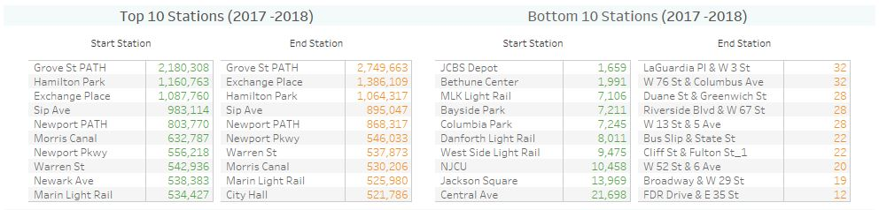
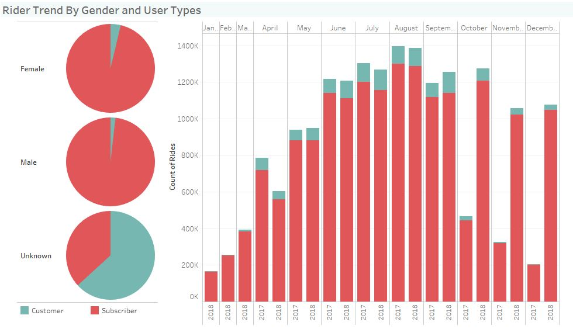
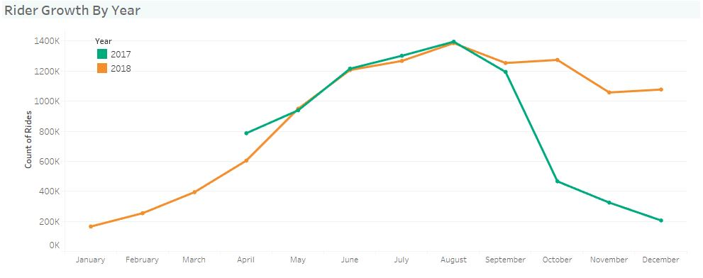

# Tableau Assignment - Citi Bike Analytics

## Background

Congratulations on your new job! As the new lead analyst for the [New York Citi Bike](https://en.wikipedia.org/wiki/Citi_Bike) Program, you are now responsible for overseeing the largest bike sharing program in the United States. In your new role, you will be expected to generate regular reports for city officials looking to publicize and improve the city program.

Since 2013, the Citi Bike Program has implemented a robust infrastructure for collecting data on the program's utilization. Through the team's efforts, each month bike data is collected, organized, and made public on the [Citi Bike Data](https://www.citibikenyc.com/system-data) webpage.

However, while the data has been regularly updated, the team has yet to implement a dashboard or sophisticated reporting process. City officials have a number of questions on the program, so your first task on the job is to build a set of data reports to provide the answers. 

## Dashboard

### Station Analysis

### Rider Analysis

### Growth Analysis

- - -

### Assessment

[Download dashboard here](https://www.dropbox.com/s/ehvkesflu7vlvsu/citibike_ucb.twbx?dl=0) for full detail and interaction or view pdf above.

## Copyright

Sandy He (C) 2019. All Rights Reserved.
